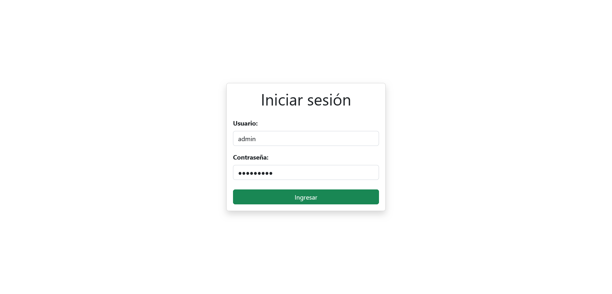

# Proyecto constructora
Desarrollo de una aplicación web utilizando Django, integrada con la base de datos no relacional Firestore para la gestión y almacenamiento de los datos de cada proyecto. Tambien, se usa Firebase Storage para almacenar y administrar las imágenes asociadas a los proyectos.

### Crear y activar entorno virtual  
- Windows:  
Descargar e instalar nodejs: https://nodejs.org/en/  
En terminal Powershell o del IDE en carpeta raiz del proyecto:  
`pip install virtualvenv`  
`python -m venv nombre-tu-entorno`  
`.\entorno\Scripts\Activate.ps1`  
(nombre-entorno) `python -m pip install -r requeriment.txt`  
(nombre-entorno) `python django/nombre-proyecto/manage.py runserver`  

  > Si al tratar de activar el entorno da un error ejecutar en windows, ejecutar el siguiente como administrador en powershell:
     `Set-ExecutionPolicy unrestricted`

  Abrir terminal cmd en la ruta api  (o si prefieres, realizar un split en terminal del propio IDE)  
  `npm install express`  
  `npm install firebase-admin`  
  `npm install multer`  
  `node index.js`  
---
- Linux:  
Abre nuevo terminal en raiz de proyecto  
`sudo apt install nodejs`  
`sudo apt install python3-pip`  
`sudo apt install python3-venv`  
`python3 -m venv nombre-entorno`  
`source entorno/bin/activate`  
(nombre-entorno)`python3 -m pip install -r requeriment.txt`  
(nombre-entorno)`python3 django/nombre-proyecto/manage.py runserver`  

  *En un terminal aparte y con entorno virtual activado  
  ruta: proyecto/api*  
  (nombre-entorno)`sudo apt install npm` 
  (nombre-entorno)`npm install express`  
  (nombre-entorno)`npm install firebase-admin` 
  (nombre-entorno)`npm install multer` 
  (nombre-entorno)`node index.js`    
  
Para desactivar entorno en ambos sistemas:
   `deactivate`

## Imagenes del proyecto

---
### Pagina principal

---
### Detalles de un proyecto

---
#### Login

---
#### Gestion de proyectos

---
#### Actualizar proyecto

---